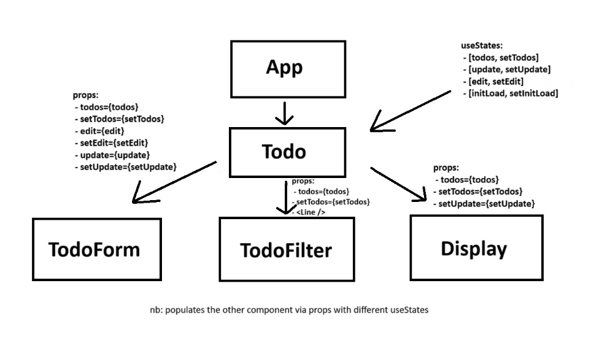

    <h1>
    Dat3 React CRUD - TODO APP 
    
    </h1>

#### By: Oskar Daniel Olsen

## Description

Todo Application :

This application is made for keeping your tasks organized and manageable. The application is designed to simple and easy add edit and delete tasks, to ensure your tasks are always up to date.
The primary goal of this application is to provide a seamless experience for managing tasks and keeping track of what needs to be done.

#### Key Features:

1. Create: Add new tasks to your to-do list with a simple click. The app allows you to add a task with a note, due date, and priority level, ensuring you have all the information you need to stay organized.

2. Read: View your to-do list for a quick overview of your tasks. The app displays all your tasks in a clean, easy-to-read format, so you can stay on top of your to-do list.

3. Update: Stay flexible with the ability to edit tasks. Whether you need to change a due date or update task details, the app ensures you have the control to adapt to evolving priorities.

4. Delete: Remove completed or unnecessary tasks with a simple delete function. Keeping your to-do list clutter-free is just a click away.

5. Filter/Sort: Organize your tasks efficiently by using the app's filtering and sorting options. You can arrange tasks by ID, note, due date, or priority, allowing you to focus on what matters most.

## Components

